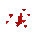

## Hi there 

I'm ANU, a Frontend Web Application Developer with working knowledge of Backend development. My primary focus is frontend development, and I’m currently continuing my studies in backend development. I spend most of my time coding outstanding projects. Check out [my personal website](https//:mywebsite.com) to learn more about me.

### 🤝 Connect with me!

## 💻 What I'm Working On

 

<table align="center">
  <tr>
    <td align="center" style="border: 1px solid #ddd; padding: 15px; border-radius: 10px;">
      
    </td>
    <td align="center" style="border: 1px solid #ddd; padding: 15px; border-radius: 10px;">
      
    </td>
    <td align="center" style="border: 1px solid #ddd; padding: 15px; border-radius: 10px;">
      
    </td>
  </tr>
</table>

## 🛠️ My Tech Stack

### Programming Languages

  
  

### Frontend Development

  
  
  
  
  
  

<!--
**ANU-X/ANU-X** is a ✨ _special_ ✨ repository because its `README.md` (this file) appears on your GitHub profile.

Here are some ideas to get you started:

- 🔭 I’m currently working on ...
- 🌱 I’m currently learning ...
- 👯 I’m looking to collaborate on ...
- 🤔 I’m looking for help with ...
- 💬 Ask me about ...
- 📫 How to reach me: ...
- 😄 Pronouns: ...
- ⚡ Fun fact: ...
-->
